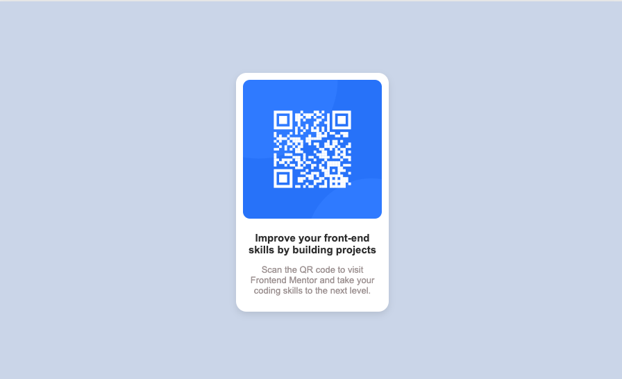

# Frontend Mentor - QR code component

# Frontend Mentor - QR code component solution

This is a solution to the [QR code component challenge on Frontend Mentor](https://www.frontendmentor.io/challenges/qr-code-component-iux_sIO_H). Frontend Mentor challenges help you improve your coding skills by building realistic projects.

## Table of contents

- [Overview](#overview)
  - [Screenshot](#screenshot)
  - [Links](#links)
- [My process](#my-process)
  - [Built with](#built-with)
  - [What I learned](#what-i-learned)
  - [Continued development](#continued-development)
  - [Useful resources](#useful-resources)
- [Author](#author)
- [Acknowledgments](#acknowledgments)

**Note: Delete this note and update the table of contents based on what sections you keep.**

## Overview
This project is a solution to the FrontEnd Mentor QR Code Challenge, where I built a simple and responsive QR code component using HTML and CSS. The goal was to practice layout structuring, styling, and responsiveness while ensuring the design closely matches the given challenge specifications.

Through this project, I improved my skills in:
	•	Using Flexbox to center elements effectively.
	•	Implementing responsive design for better mobile and desktop views.
	•	Writing clean, structured, and maintainable CSS.

I also focused on accessibility by adding appropriate alt text to the QR code image and ensuring the design meets basic contrast and readability standards.

### Screenshot


### Links

- Solution URL: [Add solution URL here](https://github.com/DamarisMB/qr-code)
- Live Site URL: [Add live site URL here](https://your-live-site-url.com)

## My process
- This project really put my knowledge to the test. I researched when I would get stuck. It was fun to replicate it and see how much I have learned as a self taught developer. 
-

### Built with

- Semantic HTML5 markup
- CSS custom properties
- Flexbox
- CSS Grid
- Mobile-first workflow
- Google Fonts (https://fonts.google.com/) - For style fonts

### What I learned

I found it fun and challanging as a beginner to figure out the container height to replicate the end result. Originally I started with height: 400px and the container was smaller than the QR code card. Instead of a fixed height, updated code to min-height and that increased the container size.
Started off with:

````css
.container {
  width: 90%;
  max-width: 900px;
  height: 400px;
}
&modifiedto: ```css .container {
  width: 90%;
  max-width: 900px;
  min-height: 60vh;
}
````

### Continued development

Flex-box is still an area I need practice with. I will continue to build projects to help me get more comfortable with it.

### Useful resources

- [ mdn\_ ](https://developer.mozilla.org/en-US/) - This helped me with flex box. It was easier for me to trouble shoot my code while researching in mdn.

## Author

- Website - [Damaris Barajas](https://www.your-site.com)
- Frontend Mentor - [@DamarisMB](https://www.frontendmentor.io/profile/DamarisMB)

